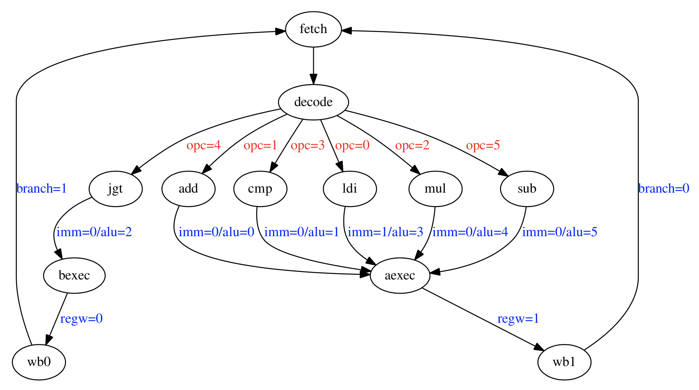

# Exercise 4
We are to translate the following instructions into binary code.
```
0x00 ldi %r2, 1
0x04 ldi %r1, 1
0x08 mul %r2, %r2, %r0
0x0C sub %r0, %r0, %r1
0x10 cmp %r3, %r0, %r1
0x14 jgt %r3, -16
```

We are given one example in the exercise handout:

add %r7, %r8, %r9 translates to
```
00001 00111 01000 01001 XXXX XXXX XXXX
add   r7    r8    r9
```

See page 5 in the handout for state diagram of the machine. (shown below)

We can see the opcodes listed as...

| opcode | int | binary |
| ------ | --- | ------ |
| ldi    | 0   | 00000  |
| add    | 1   | 00001  |
| mul    | 2   | 00010  |
| cmp    | 3   | 00011  |
| jgt    | 4   | 00100  |
| sub    | 5   | 00101  |


## SOLUTION, step by step
| pc   | opcode |       |             |                | 
| ---- | ------ | ----- | ----------- | -------------- |
| 0x00 | ldi    | %r2   | 1           |                |
|      | 00000  | 00010 | 00000 00000 | 0000 0000 0001 |
| 0x04 | ldi    | %r1   | 1           |                |
|      | 00000  | 00001 | 00000 00000 | 0000 0000 0001 |
| 0x08 | mul    | %r2   | %r2         | %r0            |
|      | 00010  | 00010 | 00010 00000 | XXXX XXXX XXXX |
| 0x0C | sub    | %r0   | %r0         | %r1            |
|      | 00101  | 00000 | 00000 00001 | XXXX XXXX XXXX |
| 0x10 | cmp    | %r3   | %r0         | %r1            |
|      | 00011  | 00011 | 00000 00001 | XXXX XXXX XXXX |
| 0x14 | jgt    | %r3   | -16         |                |
|      | 00100  | 00011 | 11111 11111 | 1111 1111 0000 |

## Answer
```binary
00000000100000000000000000000001
00000000010000000000000000000001
00010000100001000000XXXXXXXXXXXX
00101000000000000001XXXXXXXXXXXX
00011000110000000001XXXXXXXXXXXX
00100000111111111111111111110000
```
