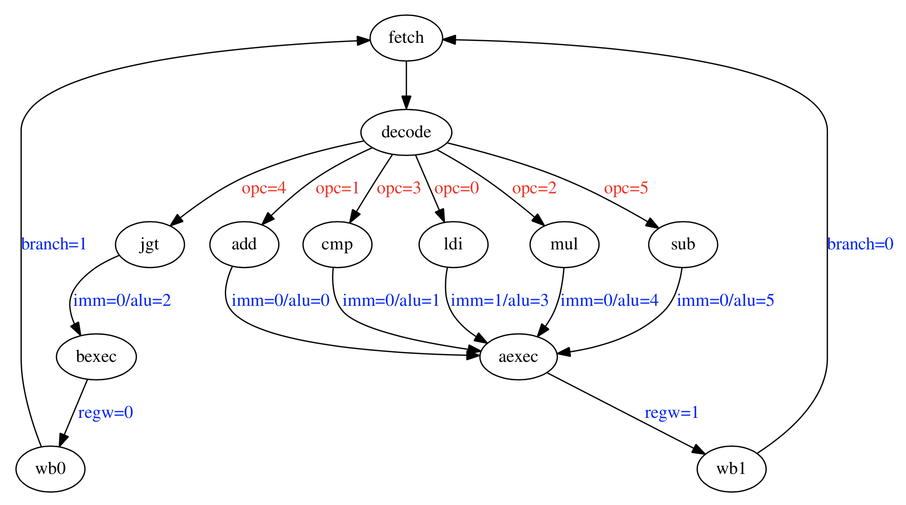

# Exercise 6
Assume that register %r0 contains 1 before the program is executed. Given the microarchitecture in Section 2 and the control unit’s state machine in Section 3, write down the values of the control unit’s output signals for each executed instruction in the following order: imm, alu, regw, branch.

**Submission**
Hand in a plain text file with the values for each executed instruction per line.

- [Exercise 6](#exercise-6)
    - [Step by step solution](#step-by-step-solution)
    - [SOLUTION](#solution)

## Step by step solution
This exercise is as easy as reading off the state machine schema during execution of the program.

The program is still:
```
0x00 ldi %r2, 1
0x04 ldi %r1, 1
0x08 mul %r2, %r2, %r0
0x0C sub %r0, %r0, %r1
0x10 cmp %r3, %r0, %r1
0x14 jgt %r3, -16
```

And we can write it out more clear as a sheet.

| #        |      |      |      |      | R0   | R1   | R2   | R3    | imm | alu | regw | branch |
| -------- | ---- | ---- | ---- | ---- | ---- | ---- | ---- | ----- | --- | --- | ---- | ------ |
|          |      |      |      |      | 1    |      |      |       |     |     |      |        |
| 0x00     | ldi  | %r2  | 1    |      |      |      | 1    |       |     |     |      |        |
| 0x04     | ldi  | %r1  | 1    |      |      | 1    |      |       |     |     |      |        |
| 0x08     | mul  | %r2  | %r2  | %r0  |      |      | 1    |       |     |     |      |        |
| 0x0C     | sub  | %r0  | %r0  | %r1  | 0    |      |      |       |     |     |      |        |
| 0x10     | cmp  | %r3  | %r0  | %r1  |      |      |      | 0b100 |     |     |      |        |
| 0x14     | jgt  | %r3  |      | -16  |      |      |      |       |     |     |      |        |
| ----     | ---- | ---- | ---- | ---- | ---- | ---- | ---- | ----  |     |     |      |        |
| SOLUTION |      |      |      |      |      |      | 1    |       |     |     |      |        |

NB. I have also written down the Register-values just so we can see that the program actually ends with just *"one go"*.

Notice that we are interested in finding the values for imm,alu,regw and branch for each step. Let's feed the state-machine some input and read its outputs for each step.


| opcode | imm | alu | regw | branch |
| ------ | --- | --- | ---- | ------ |
| ldi    | 1   | 3   | 1    | 0      |
| mul    | 0   | 4   | 1    | 0      |
| sub    | 0   | 5   | 1    | 0      |
| cmp    | 0   | 1   | 1    | 0      |
| jgt    | 0   | 2   | 0    | 1      |


And then it's just a matter of filling out each program-step with the corresponding *"opcode outputs"*.

| #        |      |      |      |      | R0   | R1   | R2    | R3    | imm | alu | regw | branch |
| -------- | ---- | ---- | ---- | ---- | ---- | ---- | ----- | ----- | --- | --- | ---- | ------ |
|          |      |      |      |      | 1    |      |       |       |     |     |      |        |
| 0x00     | ldi  | %r2  | 1    |      |      |      | 1     |       | 1   | 3   | 1    | 0      |
| 0x04     | ldi  | %r1  | 1    |      |      | 1    |       |       | 1   | 3   | 1    | 0      |
| 0x08     | mul  | %r2  | %r2  | %r0  |      |      | 1     |       | 0   | 4   | 1    | 0      |
| 0x0C     | sub  | %r0  | %r0  | %r1  | 0    |      |       |       | 0   | 5   | 1    | 0      |
| 0x10     | cmp  | %r3  | %r0  | %r1  |      |      |       | 0b100 | 0   | 1   | 1    | 0      |
| 0x14     | jgt  | %r3  |      | -16  |      |      |       |       | 0   | 2   | 0    | 1      |

## SOLUTION
```
1310
1310
0410
0510
0110
0201
```
